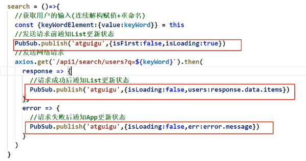

##### babel.js =>ES6转ES5

##### 先引入react(react核心库)|React

##### 再引入react-dom(react操作dom)|ReactDom

-------------

##### 引入prop-types(用于对组件标签属性进行限制)|PropTypes

对象.propTypes={

​	属性:PropTypes.string.isRequired,//该属性需为字符串(string)，且必填(isRequired)

}

对象.defaultProps={

​	属性:"默认值",//若该属性没有传值，则为默认值

}

放在class对象内则是

```react
static propTypes={ //使用static创建静态属性
	//code...
}
```

------

##### `render()`

`ReactDOM.render(element,container[,callback]);`

在容器(container)内渲染一个react元素(element)

组件开头大写

类式组件需继承父类React.Component，必须有render()

```react
class MyComponent extends React.Component{
    
    //构造器是否接收props,并传递给super,取决于：是否希望在构造器中通过this访问props
    constructor(props){
        super(props);
        //code...
    }
    //！render是必须的
	render(){
        //code...
        return
    }
}
```

构造器内初始化状态this.state={}

.bind(this)生成一个新的函数，改变函数内的this(改变视具体传值而定)

-------

##### ref

1. ###### 字符串形式的ref（官方不推荐使用）

```react
class MyComponent extends React.Component{
    showData=()=>{
   		const {tar}=this.refs;
   		console.log(tar)
   	}
   	render(){
        return <div ref="tar" onClick={this.showData}></div>
   	}
} 
```

2. ###### 回调形式的ref

```react
//如果 ref 回调函数是以内联函数的方式定义的，在更新过程中它会被执行两次，第一次传入参数 null，然后第二次会传入参数 DOM 元素。
class MyComponent extends React.Component{
    showData=()=>{
   		const {tar}=this;
   		console.log(tar)
   	}
    show=(c)=>{
       this.tar=c
        console.log(this.tar)
    }
   	render(){
        return <div ref={a=>this.tar=a}></div> //内联(常用)
        return <div ref={this.show}></div> //类绑定
   	}
}
```

3. ###### createRef() (官方推荐使用)

```react
class MyComponent extends React.Component{
    //React.createRef()调用后可以返回一个容器，该容器可以存储被ref所标识的节点，该容器是专人专用的
    myRef=React.createRef();
    showData=()=>{
   		console.log(this.myRef.current)
   	}
   	render(){
        return <div ref={this.myRef} onClick={this.showData}></div>
   	}
}
```

-----

##### 生命周期

```react
???=()=>{
    //卸载组件
    ReactDOM.unmountDomponentAtNode(document.getElementById("?"));
}

//组件挂载完毕（只调用一次|通常用于放置定时器）
componentDidMount(){
    //code...
}

//组件将要被卸载(卸载前|通常用于清除定时器)
componentWillUnmount(){
    //code...
}

//初始化渲染、状态更新之后
render(){
    return 
}
```

1. ###### 生命周期(旧)

    1. 初始化阶段：由ReactDOM.render()触发----初次渲染
    	1. constructor()
    	2. componentWillMount()
    	3. render()
    	4. componentDidMount()   **！！常用 ！！组件挂载完毕的钩子**
    2. 更新阶段：由组件内部this.setState()或父组件重新render触发
    	1. shouldComponentUpdate()
    	2. componentWillUpdate()
    	3. render() **！！必须使用 ！！初始化渲染、状态更新之后**
    	4. componentDidUpdate()
    3. 卸载组件：由ReactDOM.unmountComponentAtNode()触发
    	1. componentWillUnmount() **！！常用 ！！组件将要卸载的钩子**

```react
 class MyComponent extends React.Component{
     //构造器
     constructor(props){
         super(props);
         //初始化状态
         this.state={}
     }
     //组件将要挂载的钩子
     componentWillMount(){
         //code...
     }
     //组件挂载完毕的钩子
     componentDidMount(){
         //code...
     }
     //组件将要卸载的钩子
     componentWillUnmount(){
         //code...
     }
     //控制组件更新的"阀门"
     shouldComponentUpdate(){
         //code...
         return true//or false
     }
     //this.forceUpdate()强制更新则不经过阀门直接更新
     
     //组件将要更新的钩子
     componentWillUpdate(){
         //code...
     }
     //组件更新完毕的钩子
     componentDidUpdate(){
         //------>可接收两个值，一个是更新前（先前）的props，一个是更新前（先前）的state
         //code...
     }
     //初始化渲染、状态更新之后
     render(){
         return(
         	<div>
            	<child toChild="传给child的props的数据"/> 
            </div>
         )
     }
 }
 class MyComponent extends React.Component{
     //组件将要接收新的props的钩子（可接收props|render初次渲染时不会执行
     componentWillReceiveProps(){
         //code...
     }
     render(){
         return
     }
 }
```

2. ###### 生命周期(新)

   * `componentWillMount()`、`componentWillUpdate()`、`componentWillReceiveProps()`命名变更，开头必需加"UNSAFE_"前缀。（官方不建议使用，未来版本将会废弃）

   * 添加了2个新的钩子

     * getDerivedStateFromProps(props, state)

     * getSnapshotBeforeUpdate()|在render和componentDidUpdate()之间

```react
//从props得到派生状态（会导致代码冗余，所以了解即可
static getDerivedStateFromProps(){//静态方法
    //code...
    return {}//必须返回状态对象或者null
}

getSnapshotBeforeUpdate(){
    //code...
    return //必须返回快照值或者null，componentDidUpdate(prevProps,prevState,snapshotValue)接收第三个参数【快照值】
}

```

-----

##### 组件通信

1. ###### 父传子

   * 通过引入子组件的地方直接传递参数。

     ===>`<App><Child toChild="toChild"/></App>`

   * 子组件通过props来直接获取参数。     

     ===>`this.props.toChild`

2. ###### 子传父

   * 在引入子组件的地方以函数形式传递给子组件。

     ===>`<Child toChild={this.toChild}>`

   * 在子组件中通过props获取该函数并附上参数。 

     ===>`this.props.toChild(data)`

   * 父组件在函数中可以直接获取到子组件传递过来的参数。

     ===>构造函数内`toChild=(data)=>{console.log(data)}`

3. ###### 兄弟传值

   * 无法直接传值，必须通过父组件作为中转站

     * 可使用插件PubSubJS	(`yarn add pubsub.js`)

       * 传值`Pubsub.publish("类似于id",{})`

         

       * 接收`PubSub.subscribe("类似于id",(msg,data)=>{console.log(data)})`
       
         
       

-------

##### react Ajax

1. 解决跨域问题

   * package.json内

     ```json
     {
         "proxy":"网址"
     }
     ```

   * src内创建setupProxy.js

     ```javascript
     const proxy = require('http-proxy-middleware')
     module.exports=function(app){
         app.use(
         	proxy('/api1',{
                 target:"网址1",
                 changeOrigin:true,//控制服务器收到的响应头中Host字段的值
                 pathRewrite:{'^/api1':''}
             }),
             proxy('/api2',{
                 target:"网址2",
                 changeOrigin:true,
                 pathRewrite:{'^/api2':''}
             }),
         )
     }
     ```

     * ###### 扩展---Fetch

       若想代码正常运行，需在外面包一个async function========>search=async()=>{//code...}

       ```react
       //1.
       fetch("url").then(
       	res=>{
               //联系服务器成功
               return res.json()
           }
       ).then(
       	res=>{
               console.log(res)
           }
       ).catch(
       	err={
               console.log(err)
           }
       )
       //2.
       try{
           const response=await fetch("url")
           const data= await response.json()
           console.log(data)
       }catch(error){
           console.log(error)
       }
       ```


-----

##### 路由

###### react router

<Route path="/demo" component={Demo}/>

demo(路由组件)接收到的props：------有三个固定属性

1. history
   * 
2. location
3. match

配置路由

1. ***compnent*** （属性或者方法）：<Route path="/demo" component={Demo}/>
2. ***render***（方法）：<Route path="/demo" render={()=><Demo count={count} />}/>
3. ***children***（方法）：children是只要配置了该属性，其里面返回的函数都会渲染，无论路径是否匹配。它能接受所有的路由属性，若不匹配`match`会为`null`


​       **NavLink标签**可以实现路由链接的高亮，通过activeClassName指定样式名，通过this.props.children可以获取标签体内容

<NavLink activeClassName="默认active" className="样式名" to="/demo">

​	标签内容

<NavLink/>

​       **Switch标签**，使<Route>在路径相同的情况下，只匹配第一个，这个可以避免重复匹配；

```react
<Switch>
    <Route path="/demo" component={Demo}/>   //只匹配第一个
    <Route path="/demo" component={Test}/>
</Switch>
```

​       解决多级路径刷新页面样式丢失问题

1. public/index.html中引入样式时不写 ./ 写 / 
2. public/index.html中引入样式时不写 ./ 写 %PUBLIC_URL%（仅适用于react）
3. 使用HashRouter

​       精准匹配**exact**

<Route exact path="/demo" component={Demo}/> 路径必须与要求的一致

​		重定向**Redirect**

<Redirect to="/home"/>页面打开后是/home