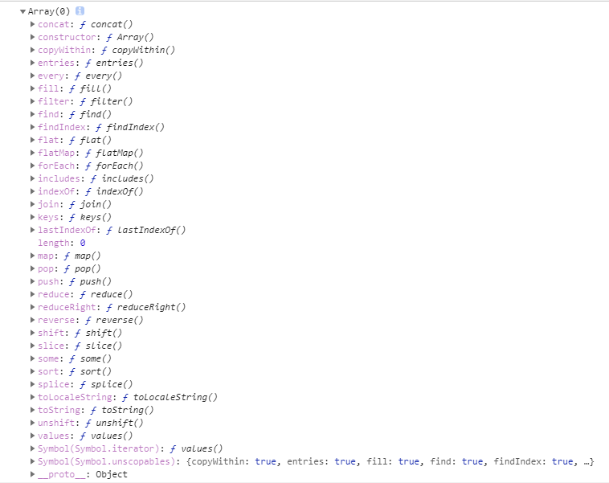

数组对象
=======
```javascript
console.log(Array.prototype);
```




#### 1. `concat()`

> 数组 `concat()`方法用于多个数组的合并。它将新数组的成员，添加到原数组成员的后部，然后**返回一个新数组，原数组不变**

```javascript
  console.log(["hello"].concat(["world"]));
   //["hello", "world"]
```

#### 2. `constructor`

> constructor属性的含义就是指向该对象的构造函数，所有函数（此时看成对象了）最终的构造函数都指向Function。

```javascript
   function a() {
    alert(1);
   }
   var b = 1;
   console.log(a.constructor);
   //ƒ Function() { [native code] }
   console.log(b.constructor);
   //ƒ Number() { [native code] }
```

#### 3. `copyWithin()`

> 复制数组的一部分数据覆盖到数组的另一个位置。并返回数组，但是不会改变原数组的长度。`copyWithin()`会修改数组，但是不会修改数组的长度

```javascript
/*arr.copyWithin(target, start, end)
 *target（必需）：从该位置开始替换数据。
 *start（可选）：从该位置开始读取数据，默认为0。如果为负值，表示倒数。
 *end（可选）：到该位置前停止读取数据，默认等于数组长度。如果为负值，表示倒数。
**/
   console.log([1, 2, 3, 4, 5, 6, 7, 8, 9, 10].copyWithin(1, 5, 7));
   //[1, 6, 7, 4, 5, 6, 7, 8, 9, 10]
   console.log([1, 2, 3, 4, 5, 6, 7, 8, 9, 10].copyWithin(1, 5, 3));
   //[1, 2, 3, 4, 5, 6, 7, 8, 9, 10] 若end在start前则不替换
```

#### 4. `entries()`

> entries()方法返回一个新的Array Iterator对象，该对象包含数组中每个索引的键/值对。

```javascript
var array = ["css", "java", "c"];
var ite = array.entries();
console.log(ite.next()); 
//{value: Array(2), done: false}  |[0, "css"] 
console.log(ite.next()); 
//{value: Array(2), done: false}  |[1, "java"]
console.log(ite.next().value); 
//[2, "c"]
```

#### 5.` every()`

> every()是对数组中每一项运行给定函数，如果该函数对每一项返回true,则返回true。

```
var arr = [6, 5, 4, 3, 2, 1];
console.log(
arr.every(function (item, index, array) {
console.log("item=" + item + ",index=" + index + ",array=" + array);
return item > 5;
})
);
```

#### 6. `fill()`

> fill() 方法用于将一个固定值替换数组的元素。

```javascript
/*Array.fill(value, start, end)
 *value为替换值，不可缺省。如果只有value，则默认替换全部值。
 *start表示开始替换的位置。
 *end表示替换结束的位置。
**/
//替换
var fruits = ["Banana", "Orange", "Apple", "Mango"];
fruits.fill("Runoob", 2, 4);
console.log(fruits);
//结果 ["Banana", "Orange", "Runoob", "Runoob"]
```

#### 7. `filter()`

> filter也是一个常用的操作，它用于把Array的某些元素过滤掉，然后返回剩下的元素。
>
> 和map()类似，Array的filter()也接收一个函数。
>
> 和map()不同的是，filter()把传入的函数依次作用于每个元素，然后根据返回值是`true`还是`false`决定保留还是丢弃该元素。

```javascript
var arr = [6, 7, 5, 4, 1, 9, 1];
//filter()接收的回调函数，其实可以有多个参数。
//通常我们仅使用第一个参数，表示Array的某个元素。
//回调函数还可以接收另外两个参数，表示元素的位置和数组本身
var newArr = arr.filter(function (correntvalue, index, array) {
	console.log(correntvalue); //当前项
	console.log(index); //当前项索引
	console.log(array); //调用filter的数组
	return true;
});
```

#### 8. `find()`

> find() 方法返回数组中满足提供的测试函数的第一个元素的值。否则返回 undefined。参数是回调函数。

```javascript
/*array.find(function(currentValue, index, arr))
 *currentValue 必需。当前元素
 *index 可选。当前元素的索引值
 *arr 可选。当前元素所属的数组对象
**/
var arr = [12, 32, 43, 2, 4, 11, 55, 12];
var va = arr.find((cur) => {
    return cur > 32;
});
console.log(va);
```

#### 9. `findIndex()`

> `findIndex()`方法返回数组中满足提供的测试函数的第一个元素的下标值。否则返回-1。

```javascript
var va = arr.findIndex((cur) => {
	return cur > 32;
});
console.log(va);
```

#### 10. `flat()`

 > 接收一个数组（这个数组中的某些item本身也是一个数组），返回一个新的一维数组(如果没有特别指定depth参数的话返回一维数组)。
```javascript
   var arr = [1, 2, [3, 4, [5, 6]]];

   console.log(arr.flat(Infinity));

   //结果 [1, 2, 3, 4, 5, 6]
```

#### 11. `flatMap()`

>`flatMap()`方法对原数组的每个成员执行一个函数，相当于执行`Array.prototype.map()`，然后对返回值组成的数组执行flat()方法。
返回一个新数组，不改变原数组。
`flatMap()`只能展开一层数组
```javascript
   /*var A = array.flatMap(function callback(current_value, index, Array)){//返回的新数组元素}
    *callback：这是在三个参数的帮助下为新数组生成元素的函数，如下所示：
    *current_value：它是输入数组元素。
    *index：这是可选的。它是input元素的索引。
    *Array：这是可选的。它在调用数组映射时使用。
    **/

   var arr = [1, 2, 3, 4, 5];
   console.log(arr.flatMap((x) => [x * 2]));

   //结果 [2, 4, 6, 8, 10]
```

#### 12. `forEach()`

> 增强版的for循环，可用于遍历数组

 

```javascript
var arr = [6, 7, 5, 4, 1, 9];
arr.forEach(function (correntvalue, index, array) {
	console.log(correntvalue); //当前项
	console.log(index); //当前项索引
	console.log(array); //调用forEach的数组
});
```


#### 13. `includes()`

>`Array.prototype.includes`方法返回一个布尔值，表示某个数组是否包含给定的值，与字符串的`includes()`方法类似。
该方法属于 ES7 ，但 Babel 转码器已经支持。
```javascript
console.log([1, 2, 3].includes(2)); //true
```


#### 14. `indexOf()`
>`indexOf()`方法可返回数组中某个指定的元素位置。
如果在数组中没找到指定元素则返回 -1。
`array.indexOf(item,start)`
item 必须。查找的元素。
start 可选的整数参数。规定在数组中开始检索的位置。它的合法取值是 0 到 stringObject.length - 1。如省略该参数，则将从字符串的首字符开始检索。
```javascript
   var fruits = [
    "Banana",
    "Orange",
    "Apple",
    "Mango",
    "Banana",
    "Orange",
    "Apple",
   ];
   console.log(fruits.indexOf("Apple", 4)); //6
```


#### 15. `join()`
>`join()` 方法用于把数组中的所有元素放入一个字符串。
`arrayObject.join(separator)`
separator 可选。指定要使用的分隔符。如果省略该参数，则使用逗号作为分隔符。
```javascript
   console.log(fruits.join()); //Banana,Orange,Apple,Mango,Banana,Orange,Apple
   console.log(fruits.join("+")); //Banana+Orange+Apple+Mango+Banana+Orange+Apple
```


#### 16. `lastIndexOf()`
>`lastIndexOf()` 方法可返回一个指定的字符串值最后出现的位置，在一个字符串中的指定位置从后向前搜索。
```javascript
   var fruits = [
    "Banana",
    "Orange",
    "Apple",
    "Mango",
    "Banana",
    "Orange",
    "Apple",
   ];
   console.log(fruits.lastIndexOf("Apple")); //6
```

#### 17. `keys()`
>`array.keys()`方法用于返回一个新的数组迭代器，该迭代器包含给定输入数组中每个索引的键。
```javascript
   var A = [5, 6, 10];
   var iterator = A.keys();
   for (let key of iterator) {
    console.log(key);
   }
```


#### 18. map()

>[JavaScript Array.map() 的 5 种用途](https://www.jianshu.com/p/39592d952faf)
`map()` 方法返回一个新数组，数组中的元素为原始数组元素调用函数处理后的值。
`map()` 方法按照原始数组元素顺序依次处理元素。
`array.map(function(currentValue,index,arr), thisValue)`
`currentValue` 必须。当前元素的值
`thisValue` 可选。对象作为该执行回调时使用，传递给函数，用作 "this" 的值。如果省略了` thisValue`，或者传入 null、undefined，那么回调函数的 this 为全局对象。
```javascript
   var arr = [2, 3, 4, 5, 6];
   var newArr = arr.map((x) => x * 2);
   console.log(newArr); //[4, 6, 8, 10, 12]
```


#### 19. `push()`、`pop()`和`unshift()`、`shift()`
>这两组同为对数组的操作，并且会改变数组的本身的长度及内容。
不同的是 push()、pop() 是从数组的尾部进行增减，unshift()、shift() 是从数组的头部进行增减。
```javascript
   var arr = [1, 2, 3, 4, 5, 6];
   //push() 方法将一个或多个元素添加到数组的末尾，并返回该数组的新长度。
   console.log(arr.push(1, 2)); //8
   console.log(arr); //[1, 2, 3, 4, 5, 6, 1, 2]

   //unshift() 方法将一个或多个元素添加到数组的开头，并返回该数组的新长度(该方法修改原有数组)。
   console.log(arr.unshift(1, 2)); //10
   console.log(arr); //[1, 2, 1, 2, 3, 4, 5, 6, 1, 2]

   //pop() 方法将删除 arrayObject 的最后一个元素，把数组长度减 1，并且返回它删除的元素的值。
   //如果数组已经为空，则 pop() 不改变数组，并返回 undefined 值。
   console.log(arr.pop()); //2
   console.log(arr); //[1, 2, 1, 2, 3, 4, 5, 6, 1]

   //shift() 方法用于把数组的第一个元素从其中删除，并返回第一个元素的值。
   console.log(arr.shift()); //1
   console.log(arr); //[2, 1, 2, 3, 4, 5, 6, 1]
```

#### 20. `reduce`
>`arr.reduce(callback,[initialValue])`
`callback` （执行数组中每个值的函数，包含四个参数）
* `previousValue` （上一次调用回调返回的值，或者是提供的初始值（`initialValue`））
* `currentValue` （数组中当前被处理的元素）
* `index` （当前元素在数组中的索引）
* `array` （调用 reduce 的数组）
`initialValue` （作为第一次调用 callback 的第一个参数。）
[JS数组reduce()方法详解及高级技巧](https://www.jianshu.com/p/e375ba1cfc47)
```javascript
arr.reduce(function(prev,cur,index,arr){
   //code...
}, init);
```
>arr 表示原数组；
`prev` 表示上一次调用回调时的返回值，或者初始值 `init`;
`cur` 表示当前正在处理的数组元素；
`index` 表示当前正在处理的数组元素的索引，若提供` init `值，则索引为0，否则索引为1；
`init` 表示初始值。
[浅谈JS中 reduce() 的用法](https://www.jianshu.com/p/541b84c9df90)

* 求和
```javascript
   var arr = [1, 2, 33, 4, 5, 5, 1, 2];
   var sum = arr.reduce(function (pre, cur) {
    return pre + cur;
   });
   console.log(arr, sum);
```
* 最大值
```javascript
   var max = arr.reduce(function (pre, cur) {
    return Math.max(pre, cur);
   });
   console.log(arr, max);
```
* 数组去重
```javascript
   var newArr = arr.reduce(function (pre, cur) {
    if (!pre.includes(cur)) {
     return pre.concat(cur);
    } else {
     return pre;
    }
   }, []);
   console.log(newArr);
```


#### 21. `reduceRight`
>reduceRight() 方法从数组的最后一项开始，向前遍历到第一项。
```javascript
   var arr = [1, 2, 33, 4, 5, 5, 1, 2];
   var sum = arr.reduceRight(function (pre, cur) {
    return pre + cur;
   });
   console.log(arr, sum);
```


#### 22. `reverse()`
>该方法用于颠倒数组中元素的顺序。
```javascript
   console.log(arr.reverse()); // [2, 1, 5, 5, 4, 33, 2, 1]
```

#### 23. `slice()`
>slice() 方法可从已有的数组中返回选定的元素。
`arrayObject.slice(start,end)`
start 必需。规定从何处开始选取
end 可选。规定从何处结束选取。(不包括该元素)
```javascript
   console.log(arr.slice(2, 6)); //[5, 5, 4, 33]
```

####24. `some()`
>该方法用于检测数组中的元素是否满足指定条件（函数提供）。
只要有一个满足条件就返回真
```javascript
   console.log(
    arr.some(function (item, index, array) {
     //console.log("item=" + item + ",index=" + index + ",array=" + array); 
     return item > 10;
    })
   ); //true
```

#### 25. `sort()`
>sort() 方法用于对数组的元素(按字符串)进行排序。

```javascript
   console.log(arr.sort()); //[1, 1, 2, 2, 33, 4, 5, 5]
```
[Array.prototype.sort()](https://developer.mozilla.org/zh-CN/docs/Web/JavaScript/Reference/Global_Objects/Array/sort)
```javascript
   console.log(arr.sort((a, b) => a - b)); //[1, 1, 2, 2, 4, 5, 5, 33]
```

#### 26. splice()
>`splice()` 方法向/从数组中添加/删除项目，然后返回被删除的项目。
>该方法会改变原始数组。
```javascript
   var fruits = [
    "Banana",
    "Orange",
    "Apple",
    "Mango",
    "Banana",
    "Orange",
    "Apple",
   ];
   console.log(fruits.splice(2, 3)); //["Apple", "Mango", "Banana"]
   console.log(fruits); //["Banana", "Orange", "Orange", "Apple"]
   console.log(fruits.splice(1, 2, "aaaaa")); //["Orange", "Orange"]
   console.log(fruits); //["Banana", "aaaaa", "Apple"]
```


#### 26. toLocaleString toString
>`toString()`：把数组转换为字符串，并返回结果，每一项以逗号分割。
>`toLocalString()`：把数组转换为本地数组，并返回结果。
>---总之在数组中使用没有区别

```javascript
   console.log(arr.toLocaleString()); //1,1,2,2,4,5,5,33
   console.log(arr.toString()); //1,1,2,2,4,5,5,33
   var dt = new Date();
   console.log(dt.toLocaleString()); //2020/11/27 下午5:25:21
   console.log(dt.toString()); //Fri Nov 27 2020 17:25:34 GMT+0800 (中国标准时间)
```


#### 27. values()
>values() 方法返回一个新的 Array Iterator 对象，该对象包含数组每个索引的值
```javascript
   var ite = fruits.values();
   for (var value of ite) {
    console.log(value);
   }
```